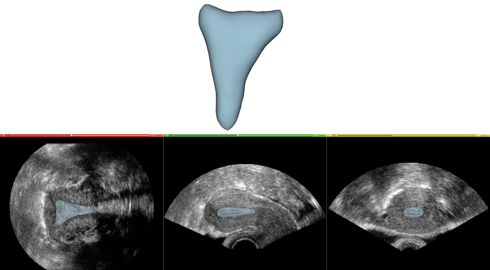

# UterUS: An Annotated Dataset of Uteri in Volumetric Ultrasound Data
This repository contains the UterUS dataset, a collection of 3D ultrasound volumes of the uterus with manual annotations of uterine cavity. It serves as a resource for researchers working on uterine morphology analysis. It also includes the nnUNet segmentation models trained on the presented dataset.



## Dataset
The dataset comprises three main directories with volumes in [Neuroimaging Informatics Technology Initiative (NIfTI-2)](https://nifti.nimh.nih.gov/nifti-2) format (.nii.gz) located in [dataset](dataset/) directory:

- [**annotated_volumes**](dataset/annotated_volumes/): contains 141 files representing ultrasound volumes of the uterus that have corresponding segmentation annotations
- [**annotations**](dataset/annotations/): contains 141 segmentation volumes corresponding to the annotated volumes
- [**volumes_without_annotations**](dataset/volumes_without_annotations/): includes 113 ultrasound volumes without associated annotations
  
The [info.csv](dataset/info.csv) file provides information about the volumes, including:
- Anonymized medical center number
- Ultrasound machine model
- Group classification (G - general population, M - consecutive miscarriages, I - unexplained infertility, RIF - recurrent implantation failure)
  
While some information is currently missing, the dataset will be regularly updated upon its availability.

### Dataset Origins
The UterUS dataset stems from a collaborative research project across several European medical centers under the initiative "**N**ormal **U**te**R**ine as**SE**ssment" (NURSE) aiming to define the normal uterus. The data originates from female subjects categorized into three groups:

- General population: Women aged 18-28 who have never been pregnant (to avoid age-related uterine anomalies)
- Unexplained infertility: Women experiencing at least 6 months of unexplained infertility despite normal semen analysis, tubal patency, and ovulation
- Recurrent miscarriages: Women with a history of 2 or more spontaneous miscarriages with normal karyotype and absence of antiphospholipid syndrome or thrombophilia

Exclusion criteria included:
- History of pregnancy
- Presence of acquired uterine abnormalities (e.g., myomas, adenomyosis)
- Endometrial polyps (inclusion permitted after polypectomy)
- Unicornuate uterus
  
Examinations were conducted during the proliferative phase of the menstrual cycle for all participants.

### Multi-Device Compatibility
While most volumes were acquired using General Electric (GE) ultrasound machines, a portion of the data originates from Samsung devices, making the dataset multi-device. GE volumes were converted to the NIfTI format using the [Slicer3D](https://www.slicer.org/) extension [SlicerHeart](https://www.slicer.org/wiki/Documentation/4.5/Extensions/SlicerHeart). Samsung volumes were converted with a dedicated tool developed by their R&D team.

## Segmentation model

Using the presented dataset, we trained the [nnUNet model](https://www.nature.com/articles/s41592-020-01008-z) for segmentation of the uterine region. You can get the trained models in 2D and 3D from [this link](nnUNet_models/). 

We used a subset of the UterUS dataset consisting of 141 annotated volumes for training and evaluation.
The training-validation split was 80/20, resulting in 113 volumes for training and 28 for validation.
The 3d_fullres model achieved an average Dice coefficient of **0.909 ± 0.046** on the validation set, 
**0.899 ± 0.076** on the test set and **0.863 ± 0.043** on the dataset consisting of data from hospitals not included in the training or testing.

You can run the prediction yourself after setting up nnUNet as presented in [their repository](https://github.com/MIC-DKFZ/nnUNet) and adding the model directories in the *nnUNet_results/Datasetxxx_name/* directory:
```
nnUNetv2_predict -d Datasetxxx_name -i INPUT_FOLDER -o OUTPUT_FOLDER -tr nnUNetTrainer -c 3d_fullres -p nnUNetPlans
```
or changing *3d_fullres* into *2d* for running the 2D model prediction (though as expected, it produces worse results).