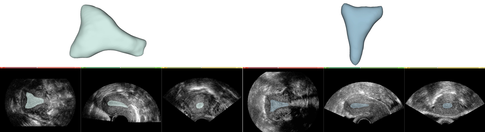
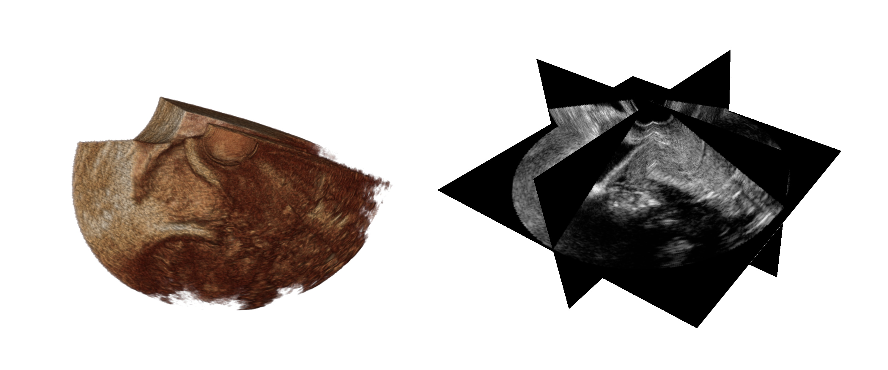

# UterUS: An Annotated Dataset of Uteri in Volumetric Ultrasound Data
### License: [CC BY-NC-SA 4.0](https://creativecommons.org/licenses/by-nc-sa/4.0/legalcode)

**Eva Boneš¹, Marco Gergolet², Ciril Bohak¹³, Žiga Lesar¹, and Matija Marolt¹**
1. University of Ljubljana, Faculty of Computer and Information Science, Večna pot 113, Ljubljana, 1000, Slovenia
2. University of Ljubljana, Faculty of Medicine, Vrazov trg 2, Ljubljana, 1000, Slovenia
3. King Abdullah University of Science and Technology, Visual Computing Center, Thuwal, 23955-6900, Saudi Arabia


This repository contains the UterUS dataset, a collection of 3D ultrasound volumes of the uterus with manual annotations of uterine cavity. It serves as a resource for researchers working on uterine morphology analysis and ultrasound/medical image analysis. It also includes the nnUNet segmentation models trained on the presented dataset.



## Dataset
The dataset consists of three main directories with volumes in [Neuroimaging Informatics Technology Initiative (NIfTI-2)](https://nifti.nimh.nih.gov/nifti-2) format (.nii.gz) located in the [dataset](dataset/) directory:

- [**annotated_volumes**](dataset/annotated_volumes/): 141 files representing _ultrasound volumes_ of the uterus that have corresponding segmentation annotations
- [**annotations**](dataset/annotations/): 141 _segmentation volumes_ corresponding to the annotated volumes
- [**volumes_without_annotations**](dataset/volumes_without_annotations/): 174 _ultrasound volumes_ without associated annotations
  
The volumes are named by the anonimized number of the medical center and the number of the sample (e.g. _04\_12.nii.gz_ comes from medical center number 4 and sample number 12). 
The [info.csv](dataset/info.csv) file provides information about the volumes, including:
- Ultrasound machine model
- Group classification (G - general population, M - consecutive miscarriages, I - unexplained infertility, RIF - recurrent implantation failure)
  
While some information is currently missing, the dataset will be regularly updated upon its availability. 
The majority of volumes currently belong to the general (G) group, as that was the main focus of the initial study. This means that the data is not yet well-suited for classification tasks that require a more diverse set of samples. However, we might be expanding the dataset to include more representative data from all groups.

### Dataset Origins



The UterUS dataset stems from a collaborative research project across several European medical centers under the initiative "**N**ormal **U**te**R**ine as**SE**ssment" (NURSE) aiming to define the normal uterus. 
The data originates from female subjects categorized into four groups:
- General population (**G**): women aged 18-28 who have never been pregnant (to avoid age-related uterine anomalies)
- Unexplained infertility (**I**): women experiencing at least 6 months of unexplained infertility despite normal semen analysis, tubal patency, and ovulation
- Recurrent miscarriages (**M**): women with a history of 2 or more spontaneous miscarriages with normal karyotype and absence of antiphospholipid syndrome or thrombophilia
- recurrent implantation failure (**RIF**): women with a history of 2 or more implantation failures

Exclusion criteria included:
- History of pregnancy
- Presence of acquired uterine abnormalities (e.g., myomas, adenomyosis)
- Endometrial polyps (inclusion permitted after polypectomy)
- Unicornuate uterus
  
Examinations were conducted during the proliferative phase of the menstrual cycle for all participants. 

### Multi-Device Compatibility
While most volumes were acquired using General Electric (GE) ultrasound machines, a portion of the data originates from Samsung devices, making the dataset multi-device. GE volumes were converted to the NIfTI format using the [Slicer3D](https://www.slicer.org/) extension [SlicerHeart](https://www.slicer.org/wiki/Documentation/4.5/Extensions/SlicerHeart). Samsung volumes were converted with a dedicated tool developed by their R&D team.

### Acknowledgments
We thank the gynecologists from the following institutions for providing the data: Gynecology Clinic Gergolet, Miguel Hernández University of Elche, Alma Mater Studiorum - University of Bologna, Gynecology Clinic at the University of Bari, Complutense University of Madrid, University of Naples, Gynecology Clinic at the University of Udine, University of Genova, Gynecology Department at the General Hospital of Forli, Imperial College London, General Hospital in Prague, University of Trieste, University of Tübingen, Aristotle University of Thessaloniki, and Clinica Victoria in Malaga.
We also thank Michele Losappio, Marco De Pasquale and Samsung's R&D team for all the help with converting their volumes for our usage. 

## Segmentation Model

Using the presented dataset, we trained a [nnUNet model](https://www.nature.com/articles/s41592-020-01008-z) for segmentation of the uterine region. You can get the trained models in 2D and 3D from [this link](https://drive.google.com/file/d/1lxHyA_UTpbhTXRuhjSMjuAFyApH9DOHo/view?usp=drive_link). 

We used a subset of the UterUS dataset consisting of 141 annotated volumes for training and evaluation.
The training-validation split was 80/20, resulting in 113 volumes for training and 28 for validation.
The 3d_fullres model achieved an average Dice coefficient of **0.909 ± 0.046** on the validation set, 
**0.899 ± 0.076** on the test set and **0.863 ± 0.043** on the dataset consisting of data from medical centers not included in the training or testing.

You can run the prediction yourself after setting up nnUNet as presented in [their repository](https://github.com/MIC-DKFZ/nnUNet) and adding the model directories in the *nnUNet_results/Datasetxxx_name/* directory. 
```
nnUNetv2_predict -d Datasetxxx_name -i INPUT_FOLDER -o OUTPUT_FOLDER -tr nnUNetTrainer -c 3d_fullres -p nnUNetPlans
```
or changing *3d_fullres* into *2d* for running the 2D model prediction (though as expected, it produces worse results).

## Cite Our Work

If you find this dataset useful, please cite our work.
```bibtex
@article{bones2024automatic,
	title        = {{Automatic Segmentation and Alignment of Uterine Shapes from 3D Ultrasound Data}},
	author       = {Eva Bone\v{s} and Marco Gergolet and Ciril Bohak and \v{Z}iga Lesar and Matija Marolt},
	year         = 2024,
	journal      = {{Computers in Biology and Medicine}},
	volume       = 178,
	pages        = 108794,
	doi          = {https://doi.org/10.1016/j.compbiomed.2024.108794},
}
```
